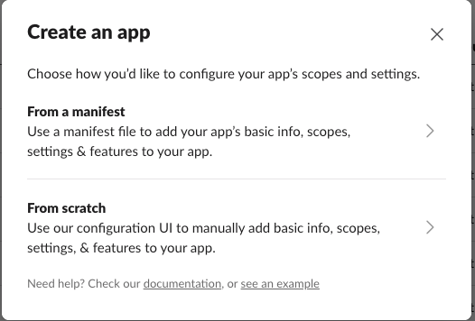
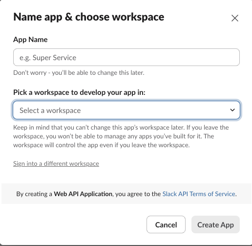
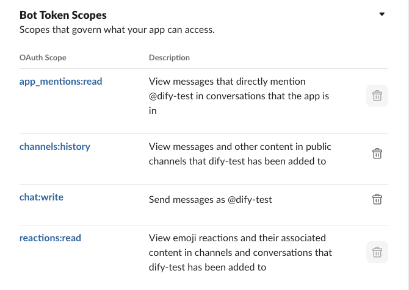
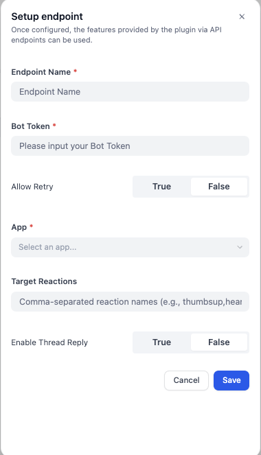

# Dify Slack Bot Plugin (slack-bot2)

**Author:** takada-at
**Version:** 0.0.1
**Type:** extension

## Overview
This repository contains an Extension-type Dify plugin that connects Slack to a Dify application. The plugin listens to Slack events (app mentions and optionally reaction_added), invokes a configured Dify app, and posts the result back to Slack (optionally in a thread).

- Entry point: main.py
- Core endpoint: endpoints/slack_bot2.py (SlackBot2Endpoint)
- Settings schema: group/slack-bot2.yaml
- Plugin manifest: manifest.yaml

## Features
- App mentions: Responds when users mention the bot in Slack (@bot)
- Reaction trigger: Optionally triggers on specified emoji reactions (reaction_added)
- Thread replies: Optionally reply in the original message thread
- Retry control: Configure whether to process Slack retry requests
- Error handling: Acknowledge Slack events and surface meaningful errors

## Setting Guide
### 1. Creating Your Slack App

1. Visit the [Slack API](https://api.slack.com/apps)
2. Click "Create New App"
3. Select "From scratch"
4. Define your app name and target workspace

### 2. Configuring the Slack App

On the "OAuth & Permissions" page, add the following scopes:

- `app_mentions:read` - To read mention events
- `channels:history` - To read messages
- `chat:write` - To post messages
- `reactions:read` - To read reaction events

Then

- Install the app to your workspace
- Locate your "Bot User OAuth Token" in settings

### 3. Endpoint Configuration

- Create a new endpoint with a custom name
- Input your Bot User OAuth Token
- Set "Allow Retry" to false (recommended to prevent duplicate messages)
- Link to your Dify chatflow/chatbot/agent
- Save and copy the generated endpoint URL

For all other configuration options, please refer to the "Plugin Configuration" section below.

### 4. Configuring Slack App Event Subscriptions
On the "Event Subscriptions" page:

1. Enable events by checking the "Enable Events" checkbox.
2. In the "Request URL" field, enter your plugin's endpoint URL.
   - Format: `https://your-dify-instance.com/plugins/endpoints/`
3. Under "Subscribe to bot events," add the following events:
   - `app_mention` - For mentions directed at the bot
   - `reaction_added` - For reaction additions (optional)

## Plugin Configuration

### 1. Basic Settings

#### Bot Token
- **Required field**
- Enter the Bot User OAuth Token obtained from your Slack App (must start with `xoxb-`)
- The input field is secured, with the value being encrypted upon storage

#### App Selection
- **Required field**
- Choose the Dify app you want to use to respond to Slack messages
- You may select from available apps in the dropdown menu

### 2. Advanced Settings

#### Allow Retry Requests
- **Optional field** (default: false)
- Determines whether to allow retry requests from Slack
- If set to `false`, the system will automatically ignore timeout or duplicate requests(Recommended)

#### Target Reactions
- **Optional field**
- Specifies reaction names to trigger a response, separated by commas
- Example: `thumbsup,heart,fire`
- If left empty, the system will respond to all reactions

#### Enable Thread Reply
- **Optional field** (default: false)
- If set to `true`, replies will be posted in the original message's thread
- If set to `false`, replies will be posted as new messages in the channel

## Usage
The bot will respond when you mention it or use a specific emoji to react to a message.

### Input Parameters
When triggered, `sys.query` contains the original Slack message. And the bot receives the following inputs data from the event.

| Parameter | Description | Type |
|-----------|-------------|------|
| channel | The ID of the channel where the event happened. | string |
| thread_ts | The timestamp of the thread. This is present if the event occurred in a thread, allowing the bot to reply in that thread. | string (optional) |
| event_type | Indicates how the bot was triggered. Can be `app_mention` or `reaction_added`. | string |
| reaction | The name of the emoji used for the reaction (e.g., `eye`). This is present only for `reaction_added` events. | string (optional) |
